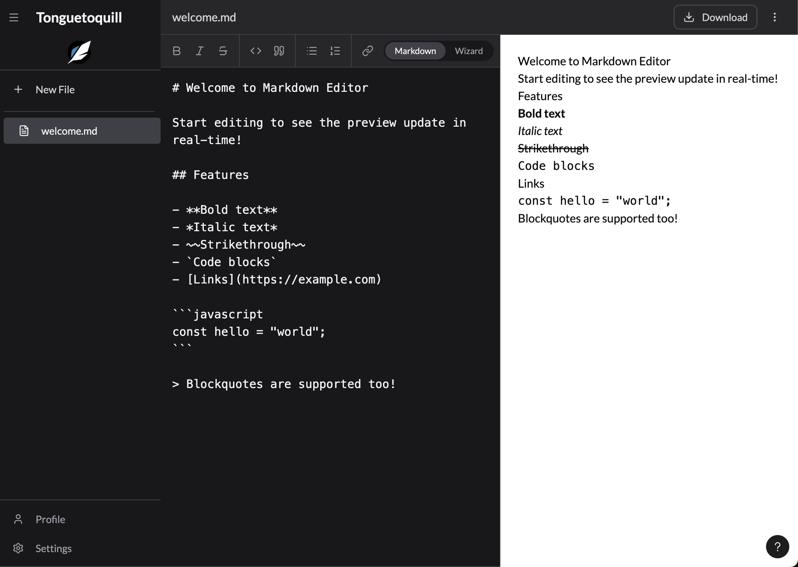
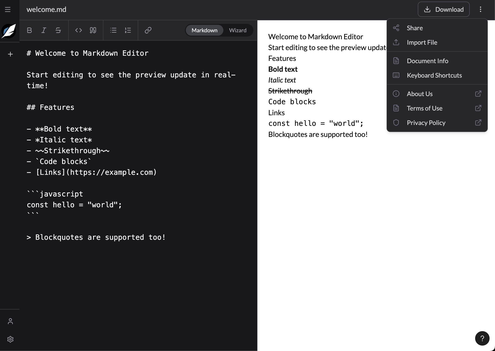

# UI Components Specification

## Overview

Component specifications for TongueToQuill, adapted for SvelteKit 5 with mobile support and accessibility. Components follow the VSCode-inspired aesthetic while supporting modern responsive design patterns.

## Layout Components

### Sidebar Component

**Purpose**: Collapsible navigation for file management, user profile, and settings

**States**:
- Desktop Expanded: 224px width, full content visible
- Desktop Collapsed: 48px width, icons only
- Mobile: Full-screen drawer overlay

**Sections**:
- Header: Toggle button + branding
- File List: Scrollable document list with create/select/delete actions
- Footer: User profile + settings access

**Mobile Behavior**:
- Renders as drawer/modal overlay
- Backdrop dismissal
- Fixed position over content

**Accessibility**: Navigation landmark, ARIA labels, keyboard navigation, focus trap in drawer mode

See  and  for visual references of the sidebar in collapsed and expanded states.

See  for settings options.

---

### TopMenu Component

**Purpose**: Header bar displaying file information and document actions

**Layout**: Logo + filename | download + more actions (meatball menu)

**Mobile Adaptation**:
- Logo scales appropriately
- Filename truncates with ellipsis
- Actions may collapse to menu
- Minimum 48px height for touch

**Accessibility**: Banner landmark, visible labels or ARIA labels, announced unsaved state

See  for visual reference of the top menu and expanded "more actions" popover menu. We should have feature parity.

---

## Editor Components

### EditorToolbar Component

**Purpose**: Formatting controls and editor mode selection

**Formatting Tools**:
- Text formatting: Bold, Italic, Strikethrough
- Blocks: Code, Quote
- Lists: Bullet, Numbered
- Links: Insert link

**Mode Toggle**: Markdown | Wizard (future)

**Mobile Adaptation**:
- Horizontal scroll for overflow
- Priority grouping
- 44px minimum touch targets
- Sticky positioning

**Accessibility**: Toolbar role, button labels, keyboard shortcuts announced

---

### MarkdownEditor Component

**Purpose**: Text input area for raw markdown editing

**Features**:
- Syntax highlighting (optional)
- Line numbers (toggleable)
- Auto-indent
- Tab handling
- Undo/redo support

**Mobile Optimization**:
- 18px minimum font (prevents zoom)
- Virtual keyboard handling
- Touch selection
- Auto-save on blur

**Accessibility**: Labeled editor region, keyboard shortcuts, status announcements

---

### MarkdownPreview Component

**Purpose**: Rendered document output display

**Rendering**:
- Quillmark for professional output
- Markdown fallback renderer
- Debounced updates
- Scroll preservation

**Mobile Optimization**:
- Touch scrolling
- Responsive typography
- Zoom enabled
- Horizontal scroll for tables

**Accessibility**: Document landmark, heading hierarchy, image alt text, color contrast

---

## UI Component Library

### Button Component

**Variants**: Primary, Secondary, Ghost, Destructive
**Sizes**: Small, Medium, Large, Icon-only
**States**: Default, Hover, Active, Focus, Disabled, Loading

**Mobile**: 44x44px minimum touch size
**Accessibility**: Focus indicators, disabled state communicated, loading announced

---

### Dialog Component

**Purpose**: Modal dialogs for confirmations, forms, and alerts

**Mobile Adaptation**:
- Full-screen on small devices
- Bottom sheet on medium devices
- Centered modal on desktop
- Swipe to dismiss (mobile)

**Accessibility**: Dialog role, modal attribute, focus trap, ESC/backdrop dismissal, focus return

---

### Dropdown Menu Component

**Purpose**: Contextual menus for actions and options

**Mobile Adaptation**:
- Bottom sheet presentation
- Larger touch targets (48px)
- Native-feeling interactions

**Accessibility**: Menu role, arrow navigation, type-ahead, focus management

---

### Toast Component

**Purpose**: Temporary notification messages

**Types**: Success, Error, Warning, Info

**Mobile Optimization**:
- Bottom positioning
- Swipe to dismiss
- Vertical stacking
- Auto-dismiss timing

**Accessibility**: Status/alert roles, live regions, screen reader announcements

---

## Document Components

### TemplateSelector Component

Keep it simple for now. 

**Purpose**: Choose document template (quill)

**Layout**:
- Desktop: Grid (3 columns)
- Mobile: List (1 column)

**Accessibility**: Radio group, keyboard navigation, preview descriptions

---

### DocumentMetadata Component

**Purpose**: Display and edit document metadata

**Fields**: Title, Subject, Letterhead, Date, Classification

**Mobile Optimization**: Full-width fields, native pickers, touch-optimized dropdowns

**Accessibility**: Form labels, required indicators, validation errors, error summary

---

## Responsive Patterns

### Breakpoint Strategy

- **sm: 640px** - Mobile landscape
- **md: 768px** - Tablet portrait
- **lg: 1024px** - Desktop
- **xl: 1280px** - Large desktop

### Layout Adaptations

**Desktop**: Sidebar (224px/48px) + split editor/preview (50/50)
**Tablet**: Drawer sidebar + split view (60/40)
**Mobile**: Full drawer + tabbed editor OR preview

### Component State

- Use Svelte 5 runes for component-local state
- Use stores for cross-component state
- Context API for dependency injection

## Touch Interactions

### Gestures
- Swipe right/left: Sidebar open/close
- Pull down: Refresh document list
- Pinch zoom: Adjust preview size

### Touch Targets
- Minimum: 44x44px
- Spacing: 8px minimum between targets
- Extended active area beyond visible bounds

## Animation Guidelines

### Transitions
- Standard duration: 300ms
- Sidebar: 300ms ease-in-out
- Modal: 150ms ease-out
- Respect `prefers-reduced-motion`

### Mobile Considerations
- Native-feeling animations
- 60fps performance target
- Reduced animations on low-end devices
